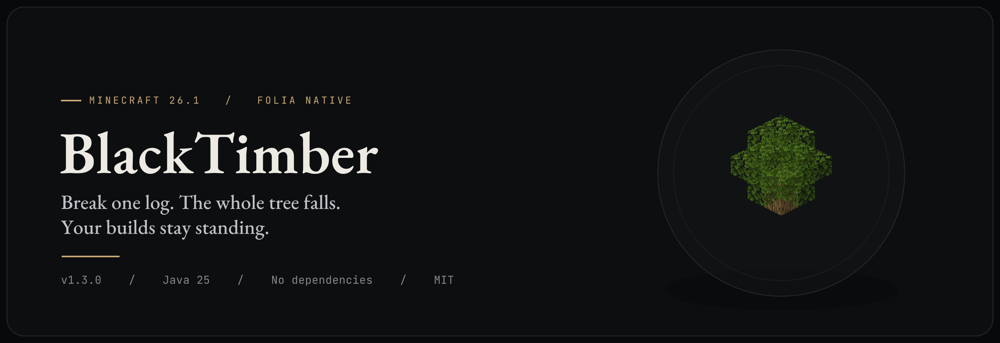
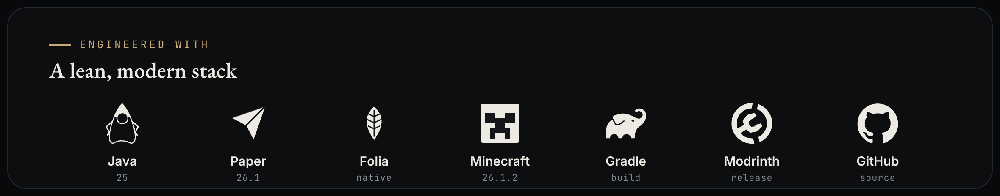
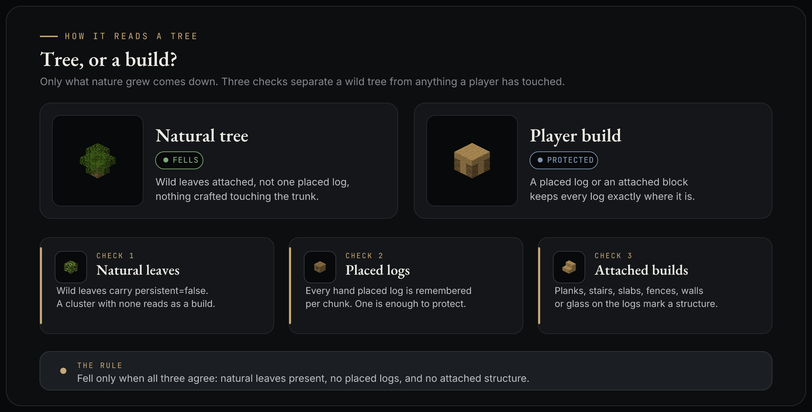
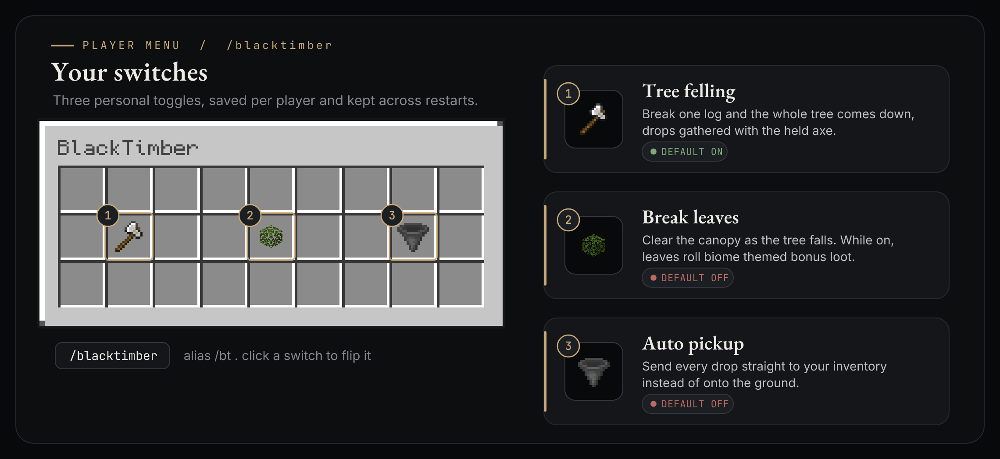
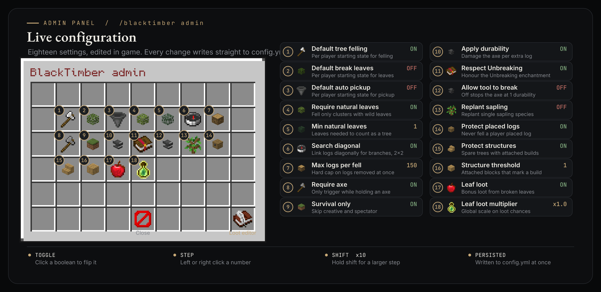
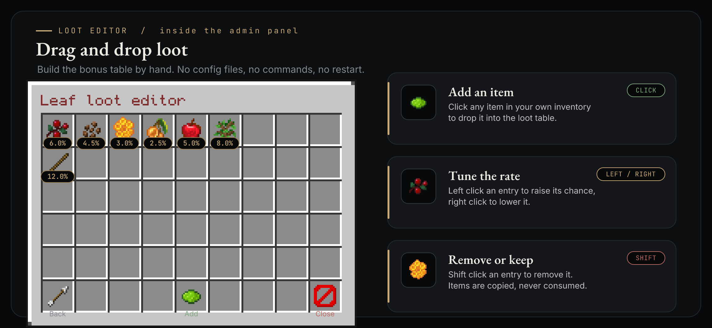

<div align="center">


<br><br>



<br><br>


<br><br>

**[Download](https://github.com/can61cebi/blacktimber/releases/latest)** &nbsp;·&nbsp;
**[Modrinth](https://modrinth.com/plugin/blacktimber)** &nbsp;·&nbsp;
**[Documentation](https://docs.cebi.tr/blacktimber)** &nbsp;·&nbsp;
**[Configuration](#configuration)** &nbsp;·&nbsp;
**[Commands](#commands)**

</div>

<br>

BlackTimber is a smart tree felling plugin for Minecraft Java Edition, written from the
ground up for Folia. Break a single log and the whole tree comes down in one motion,
gathered with the axe in your hand. Wooden houses, tree houses and hand built trees are
never touched. There is nothing to install alongside it: no library plugin, no database,
no setup. It runs the moment you drop it in. There is a full write up on
[docs.cebi.tr](https://docs.cebi.tr/blacktimber) as well.

<br>

<div align="center">
  
</div>

<br>

## The problem it solves

Classic timber plugins fell anything made of logs. That makes them a liability near a
base: one stray swing of an axe and a wall, a floor, or an entire tree house is gone.
BlackTimber takes the opposite stance. It fells only what nature grew, and it proves a
tree is wild before a single extra log is removed.

<div align="center">
  
</div>

The plugin reads three signals before it acts, and a cluster of logs comes down only when
all three agree it is wild and untouched.

1. **Natural leaves.** Every leaf block carries a `persistent` flag. Leaves on a wild or
   grown tree are `persistent = false` and decay once the tree is cut. Leaves a player
   places by hand, including ones taken with Silk Touch, are `persistent = true` and never
   decay. A cluster with no natural leaves attached is treated as a build and left alone,
   which keeps a plain wooden house standing.
2. **Placed logs.** Every log a player places is remembered. If a cluster contains even
   one placed log, the whole tree is spared. This protects a tree house and a hand built
   tree even when a natural canopy still hangs over it.
3. **Attached structures.** If crafted blocks such as planks, stairs, slabs, fences,
   doors, trapdoors, walls, ladders or glass touch the logs, the cluster counts as a
   build. These never grow on a wild tree.

So the rule is simple: fell only when there are natural leaves, no placed logs, and no
attached structure. A sapling you plant and grow is felled normally, because grown logs
are never marked as placed. The moment you build on a tree, it is protected.

## How a tree comes down

When a tree qualifies, BlackTimber flood fills the connected logs outward from the broken
block using the vanilla `minecraft:logs` tag, so every wood species is covered, including
future ones, with no code change. The search follows diagonals, so offset branches on
acacia and cherry and the 2x2 trunks of dark oak, pale oak, giant spruce and jungle are
all caught. A hard cap keeps it from ever running away. The logs are then broken and dropped
with the held tool.

Felling is bounded by the axe's durability. BlackTimber fells only as many logs as the axe
can still pay for, honoring Unbreaking per log, so it can never outrun the tool. With
`break-tool` on (the default) the axe wears down and breaks like vanilla once it runs out
mid-fell, having toppled the part it could afford and leaving the rest standing; with it off
the axe stops one point short and survives at 1 durability instead of breaking.

Leaves are left to decay like vanilla unless a player turns leaf breaking on. When they do,
BlackTimber clears the canopy by reproducing vanilla decay instantly: it flood fills the
leaves the felled logs supported and removes exactly those a surviving log no longer keeps
within range. The whole canopy goes, outer layers included, no matter how wide or tall the
tree, while an adjacent tree whose trunk still stands keeps every one of its own leaves, even
where two canopies overlap in a forest. Player placed (persistent) leaves are never touched.

Replanting is an opt in per player switch, off by default. When it is on, the species is read
from the felled trunk and a matching sapling is planted back where it stood: oak, birch,
spruce, jungle, acacia and cherry plant a single sapling, dark oak and pale oak plant their
full 2x2 only when all four cells are clear, and mangrove plants a propagule. It plants only
on ground a sapling will actually hold, dirt, grass, podzol, moss and the like plus farmland,
with clay and mud for mangrove, and never over water, lava or an occupied block, so an
unusual spot is simply left empty rather than wasting a sapling.

## Player menu

`/blacktimber` opens a small menu where each player flips four switches for themselves: tree
felling, breaking leaves, auto pickup and replanting saplings. Every choice is saved per
player and survives a restart.

<div align="center">
  
</div>

## Admin panel

`/blacktimber admin` opens the live configuration panel. Boolean settings toggle on click,
numbers step up on left click and down on right click, and holding shift takes a larger
step. Every change is written straight to `config.yml`, with no reload needed.

<div align="center">
  
</div>

## Leaf loot editor

A button in the admin panel opens the leaf loot editor. It is a drag and drop table: click
any item in your own inventory to add it, left or right click an entry to nudge its drop
rate, and shift click to remove it. Items are copied into the table, never consumed.

<div align="center">
  
</div>

When a player has leaf breaking on, each broken leaf can roll bonus loot on top of the
vanilla saplings, sticks and apples. Chances are themed by biome, with cherry petals in a
cherry grove, cocoa in the jungle, resin in a pale garden and sweet berries in a taiga,
then scaled by tree species and size, capped per leaf, and tuned by a global multiplier.
Admins add their own items and rates from the editor above.

## Commands

The plugin has one command, `/blacktimber`, with the alias `/bt`.

| Command | What it does | Permission |
| --- | --- | --- |
| `/blacktimber` | Open your personal settings menu | `blacktimber.use` |
| `/blacktimber status` | Show your settings in chat | `blacktimber.use` |
| `/blacktimber on`, `off`, `toggle` | Turn tree felling on or off for you | `blacktimber.use` |
| `/blacktimber leaves <on/off>` | Toggle breaking leaves for you | `blacktimber.use` |
| `/blacktimber pickup <on/off>` | Toggle auto pickup for you | `blacktimber.use` |
| `/blacktimber replant <on/off>` | Toggle sapling replanting for you | `blacktimber.use` |
| `/blacktimber admin` | Open the admin configuration and loot panels | `blacktimber.admin` |
| `/blacktimber reload` | Reload `config.yml` from disk | `blacktimber.admin` |

## Permissions

| Node | Default | Description |
| --- | --- | --- |
| `blacktimber.use` | everyone | Felling, plus the menu and the on, off, toggle and status commands |
| `blacktimber.admin` | operators | The admin panel and the reload command |

## Requirements

| Requirement | Detail |
| --- | --- |
| Server | Folia or Paper `26.1.2`, declared as `api-version: 26.1` |
| Java | Java `25` |
| Dependencies | None |
| Database | None |

BlackTimber ships as a single jar. It links against no other plugin, pulls in no library,
and writes no database. Player choices live in lightweight per player data, and the memory
of placed logs is stored inside the chunk itself, so nothing extra has to be installed or
maintained. See [build protection memory](#build-protection-memory) for how that works.

## Installation

1. Download `BlackTimber.jar` from the [latest release](https://github.com/can61cebi/blacktimber/releases/latest),
   or build it from source as shown below.
2. Place the jar in the server `plugins` folder.
3. Start the server. A `config.yml` is written on the first run.

## Configuration

`config.yml` is reloadable with `/blacktimber reload`, and every value here can also be
changed live from the admin panel.

| Key | Default | Description |
| --- | --- | --- |
| `require-natural-leaves` | `true` | Only fell clusters that carry natural leaves. This protects builds |
| `min-natural-leaves` | `1` | Natural leaves needed to count as a tree |
| `leaf-search-radius` | `1` | Detection only: range to confirm a trunk has natural leaves. Does not limit clearing |
| `leaf-clear-budget` | `8192` | Safety ceiling on leaves examined per fell before deferring cleanup to vanilla decay |
| `search-diagonal` | `true` | Connect logs diagonally for branches and 2x2 trunks |
| `max-logs` | `150` | Hard cap on logs removed in one fell |
| `require-axe` | `true` | Only trigger while holding an axe |
| `sneak-requirement` | `ignore` | `ignore`, `required`, or `forbidden` |
| `survival-only` | `true` | Skip creative and spectator |
| `default-enabled` | `true` | Per player default: tree felling |
| `default-break-leaves` | `false` | Per player default: break leaves |
| `default-auto-pickup` | `false` | Per player default: drops to inventory |
| `default-replant` | `false` | Per player default: replant a matching sapling at the trunk |
| `apply-durability` | `true` | Damage the axe per log felled; a worn axe only fells what it can pay for |
| `respect-unbreaking` | `true` | Honor the Unbreaking enchantment |
| `break-tool` | `true` | Let the axe break like vanilla when it runs out; false stops it at 1 durability instead |
| `protect-player-built` | `true` | Never fell a cluster that contains a player placed log |
| `protect-structures` | `true` | Protect a tree when crafted blocks are attached to it |
| `structure-block-threshold` | `1` | Attached crafted blocks needed to treat a tree as a build |
| `max-tracked-per-chunk` | `4096` | Upper bound on remembered placed logs per chunk |
| `stagger-threshold` | `64` | Fells larger than this are spread across ticks |
| `logs-per-tick` | `16` | Logs broken per tick while spreading |
| `leaf-loot-enabled` | `true` | Bonus loot from broken leaves |
| `leaf-loot-multiplier` | `1.0` | Global multiplier on bonus loot chances |
| `leaf-loot-max-chance` | `0.25` | Ceiling on any single bonus loot chance per leaf |

## Folia and performance

Folia splits the world into regions that tick in parallel on separate threads, with no
single main thread. Block data may only be touched by the thread that owns its region.
BlackTimber is built for that model from the first line.

- The break event already runs on the region thread that owns the log, so a normal tree is
  felled in place with no cross thread access.
- A very large fell is spread across ticks with the region scheduler, breaking a fixed
  budget of logs per tick so one region never stalls.
- The hot path avoids waste. Material sets are checked through cached block tags, the
  search reuses an `ArrayDeque` frontier, visited positions are packed into a `long`, and
  no temporary objects are created until a block is actually changed.
- The plugin declares `folia-supported: true` and never calls the legacy Bukkit scheduler,
  which Folia does not provide.

## Build protection memory

To tell a grown tree from a tree house, BlackTimber records every log a player places.
Positions are stored per chunk in the chunk `PersistentDataContainer`, which is saved to
disk with the chunk, so the memory survives restarts with no database and no extra files.
The store is owned by the chunk's region thread, matching how Folia isolates data, and is
touched only inside the place and break events that already run on that thread. Breaking a
tracked log forgets it, so a tree returned to a fully natural state can be felled again.

## Building from source

```
git clone https://github.com/can61cebi/blacktimber.git
cd blacktimber
./gradlew build
```

The jar is written to `build/libs`. The build uses the Gradle wrapper, so only a Java 25
toolchain is required.

## Background notes

These are the facts the plugin is built on, verified against the live game and server.

- **Versioning.** Mojang moved to a year based scheme in late 2025. Version 26.1.2 means
  year 2026, first drop, second hotfix. The Bukkit API string is `26.1.2-R0.1-SNAPSHOT`
  and `plugin.yml` takes `api-version: 26.1`.
- **Block tags.** `minecraft:logs` covers all overworld wood plus crimson and warped
  stems, exposed in Bukkit as `Tag.LOGS`. Using the tag means new species are handled
  without a code change. Bamboo is not in this tag and is left out by design.
- **Leaf persistence.** Natural leaves are `persistent = false` and decay; placed leaves
  are `persistent = true` and do not. Bukkit exposes this through
  `org.bukkit.block.data.type.Leaves`. This flag is the core of build detection.
- **Leaf decay range.** In Java Edition a natural leaf survives within 6 orthogonal blocks
  of a log and decays at distance 7. BlackTimber's leaf clearing reproduces this rule
  exactly, which is why it clears a felled tree's whole canopy but never a neighbour's,
  even where two canopies overlap.
- **Tree shapes.** Small trees are a single trunk. Dark oak and pale oak are always 2x2,
  and mega spruce and giant jungle can be 2x2 as well. Acacia, cherry and azalea trees grow
  at an angle with offset canopies. A connected, diagonal aware search handles all of these,
  which is why a simple vertical scan is not used.

## Notes and limits

- Logs past the first are removed directly, so block protection plugins do not see them.
  Use BlackTimber on servers where that is acceptable.
- Nether fungi, crimson and warped, have no leaves, so they are never felled.
- Mangrove roots and the pale oak creaking heart are not logs and are left in place.
- Logs placed before the plugin was installed are not remembered, so a pre existing tree
  house is protected by the attached structure check and the leaf check, but not by the
  placed log check. Anything built after install is fully tracked.
- Logs moved by pistons are not re tracked.

## Telemetry and privacy

<div align="center">
  
</div>

<br>

The chart above is live. To keep it honest, and to let players and admins see how widely
the plugin is trusted, BlackTimber reports anonymous usage stats. Once every fifteen
minutes a server sends a small ping that contains only:

- a random id the server generated for itself, not tied to its IP or hardware,
- the current online player count,
- the server software, the plugin version and the Minecraft version.

That is the whole payload. No IP address is stored, no player names or UUIDs are ever
sent, and nothing is linked to any person. The data is anonymous and aggregate, in the
same spirit as bStats and within GDPR and KVKK, which do not cover anonymous data. The
stats service runs on `cebi.tr` and the work happens on the async scheduler, never on a
region thread, so it cannot affect the server.

Opt out completely at any time by setting `telemetry: false` in `config.yml`. The full
disclosure, including the exact request and what is deliberately left out, is in
[`TELEMETRY.md`](TELEMETRY.md).

## Credits

Item and block artwork in the menu illustrations is rendered from Minecraft textures, which
are property of Mojang Studios. The visual suite uses the EB Garamond, Inter, JetBrains Mono
and Monocraft typefaces, all open licensed. Technology marks belong to their respective
projects. BlackTimber is an independent project and is not affiliated with Mojang or
Microsoft.

## License

Released under the MIT License. See [`LICENSE`](LICENSE).
